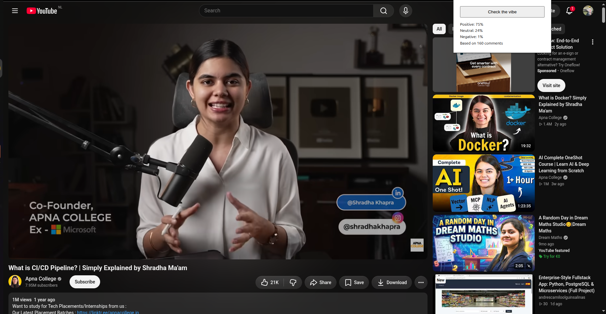
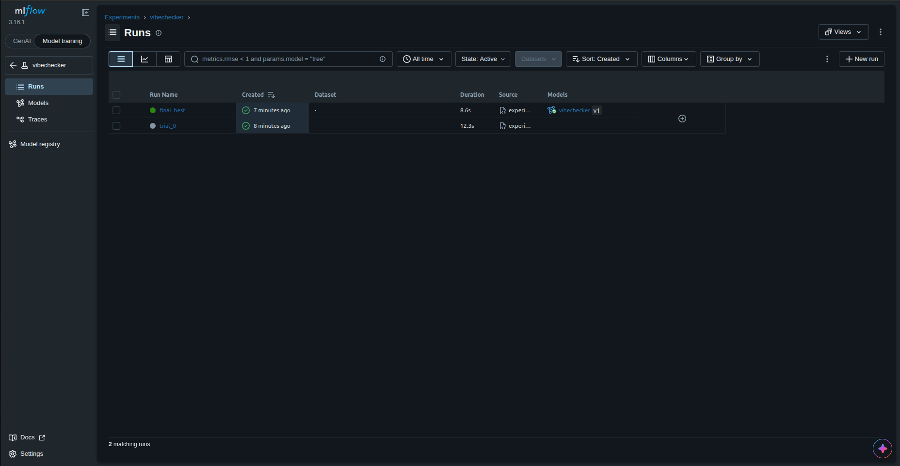

# VibeChecker

A Chrome extension that reads the comments on a YouTube video and tells you the vibe: how many are positive, neutral and negative. A scikit-learn model served by FastAPI does the classifying, and MLflow tracks every experiment.




## How it works

```
YouTube page -> content.js (reads loaded comments) -> popup.js -> background.js -> POST /predict (FastAPI) -> TF-IDF + Logistic Regression -> sentiment counts back to the popup
```

- The extension collects the comments currently loaded on the page.
- The background worker sends them in one batch to the API.
- The API cleans the text and predicts negative, neutral or positive for each comment.
- The popup shows the percentage split.

## Model

Trained on about 37k labeled Reddit comments with three classes (negative, neutral, positive).

| Model | Accuracy | Macro F1 |
|---|---|---|
| Baseline (TF-IDF + Logistic Regression, C=1) | 0.8474 | 0.8376 |
| Tuned (Logistic Regression, C=10, word unigrams) | 0.8929 | 0.8832 |

The tuned model came from a 25 trial random search over the vectorizer and classifier settings. Models were selected on a validation split and scored once on a held-out test split. Every trial is logged in MLflow.



## Quick start

You need Python 3.10 or newer and Google Chrome.

1. Clone and install

```bash
git clone https://github.com/MalahimHaseeb/vibechecker.git
cd vibechecker
python -m venv .venv
source .venv/bin/activate
pip install -r requirements.txt
```

On Windows activate with `.venv\Scripts\activate`.

2. Start the API (the trained model is included in `models/model.joblib`)

```bash
python -m uvicorn api.main:app
```

3. Check it works

```bash
curl -X POST http://localhost:8000/predict -H "Content-Type: application/json" -d '{"comments": ["this video is amazing", "worst video ever"]}'
```

4. Load the extension

- Open `chrome://extensions`
- Turn on Developer mode
- Click Load unpacked and select the `extension` folder
- Open a YouTube video, scroll down until comments load, click the VibeChecker icon and press the button

YouTube loads comments as you scroll, so only the comments already on screen are analyzed.

## Retrain and track experiments

```bash
python src/experiment.py
mlflow ui
```

Open http://localhost:5000 to compare runs. The script downloads the dataset on first run and caches it in `data/`.

- Set `FIXED_PARAMS = None` in `src/experiment.py` to run the full random search, or fill it in to refit one configuration.
- Run `python src/register_best.py` to register the best run in the MLflow model registry with the `champion` alias.

## Project structure

```
vibechecker/
  src/
    data.py            dataset download and caching
    preprocess.py      text cleaning shared by training and the API
    train.py           baseline training run
    experiment.py      random search with MLflow tracking
    register_best.py   registers the best run as champion
  api/main.py          FastAPI service with the /predict endpoint
  extension/           Manifest V3 Chrome extension
  models/              trained model
  docs/                screenshots
```

## Limitations

- The model is trained on Reddit text, and YouTube comments use different slang, emojis and shorthand, so accuracy will be lower than the numbers above.
- English only.
- Only comments loaded on the page are analyzed.
- The extension points at `localhost:8000`, so the API has to be running on your machine.

## Roadmap

- Unit tests and API tests
- Dockerfile and a published image
- GitHub Actions for tests, retraining with a metric gate, and image builds
- Hosted API with HTTPS and a Chrome Web Store release
- A small hand-labeled YouTube evaluation set

## Author

Malahim Haseeb, [malahim.dev](https://malahim.dev), [GitHub](https://github.com/MalahimHaseeb)

## License

MIT